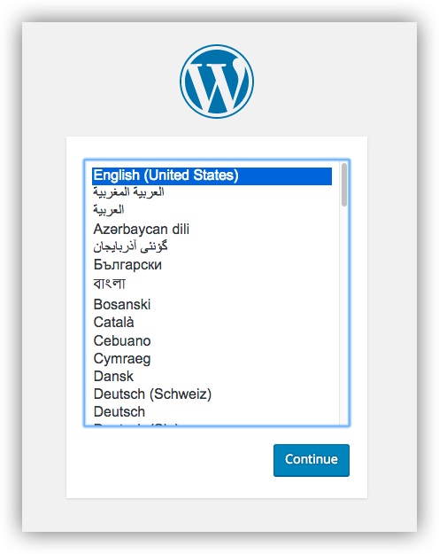
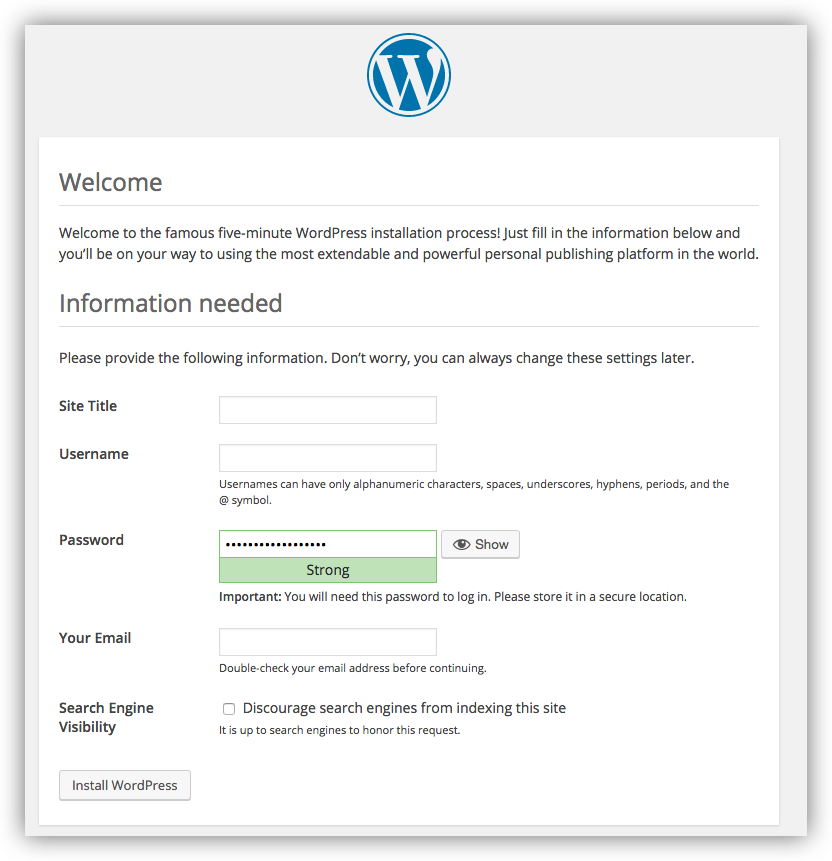

# Démarrage rapide : Compose et WordPress

Vous pouvez utiliser Docker Compose pour exécuter facilement WordPress dans un environnement isolé
construit avec des conteneurs Docker. Ce guide de démarrage rapide montre comment utiliser
Compose pour configurer et exécuter WordPress. Avant de commencer, assurez-vous d'avoir
[Compose installé](https://docs.docker.com/compose/install/).
## Quelques commande necessaire
`sudo apt-get update/
sudo apt install docker docker-compose -y/
sudo usermod -aG docker $USER/
docker ps/`

`docker ps` **montre uniquement les conteneurs en cours d’exécution pour savoir ce qui tourne sur ton système Docker.**
   > **Remarques**:
   >
   * Les volumes docker `db_data` et `wordpress_data` conservent les mises à jour effectuées par WordPress
   à la base de données, ainsi qu'aux thèmes et plugins installés. [En savoir plus sur les volumes Docker](https://docs.docker.com/storage/volumes/)
   >
   * WordPress Multisite fonctionne uniquement sur les ports « 80 » et « 443 ».
   {: .note-vanilla}

### Construire le projet

Maintenant, exécutez « docker compose up -d » depuis votre répertoire de projet.

Cela exécute [`docker compose up`](https://docs.docker.com/engine/reference/commandline/compose_up/) en mode détaché, extrait
les images Docker nécessaires et démarre les conteneurs WordPress et de base de données, comme indiqué dans
l'exemple ci-dessous.

```console
$ docker compose up -d

Création du réseau « my_wordpress_default » avec le pilote par défaut
Extraction de la base de données (mysql:5.7)...
5.7 : Extraction depuis la bibliothèque/mysql
efd26ecc9548 : Extraction terminée
a3ed95caeb02 : Extraction terminée
<...>
Résumé : sha256:34a0aca88e85f2efa5edff1cea77cf5d3147ad93545dbec99cfe705b03c520de
Statut : Image plus récente téléchargée pour mysql : 5.7
Extraction de WordPress (wordpress:latest)...
dernier: Extraction de la bibliothèque/WordPress
efd26ecc9548 : existe déjà
a3ed95caeb02 : Extraction terminée
589a9d9a7c64 : Extraction terminée
<...>
Résumé : sha256:ed28506ae44d5def89075fd5c01456610cd6c64006addfe5210b8c675881aff6
Statut : Téléchargement d'une image plus récente pour WordPress : latest
Création de ma_base_wordpress_1
Création de mon_wordpress_wordpress_1
```

> **Remarque** : WordPress Multisite fonctionne uniquement sur les ports « 80 » et/ou « 443 ».
Si vous recevez un message d'erreur concernant la liaison de « 0.0.0.0 » au port « 80 » ou « 443 »
(selon celui que vous avez spécifié), il est probable que le port que vous
configuré pour WordPress est déjà utilisé par un autre service.

### Lancez WordPress dans un navigateur Web

À ce stade, WordPress devrait fonctionner sur le port « 80 » de votre hôte Docker,
et vous pouvez terminer la « célèbre installation en cinq minutes » en tant que WordPress
administrateur.

> **Remarque** : le site WordPress n'est pas immédiatement disponible sur le port « 80 »
car les conteneurs sont encore en cours d'initialisation et peuvent prendre quelques
minutes avant le premier chargement.

Si vous utilisez Docker Desktop pour Mac ou Docker Desktop pour Windows, vous pouvez utiliser
`http://localhost` comme adresse IP et ouvrez `http://localhost:80` dans un navigateur Web
navigateur.






