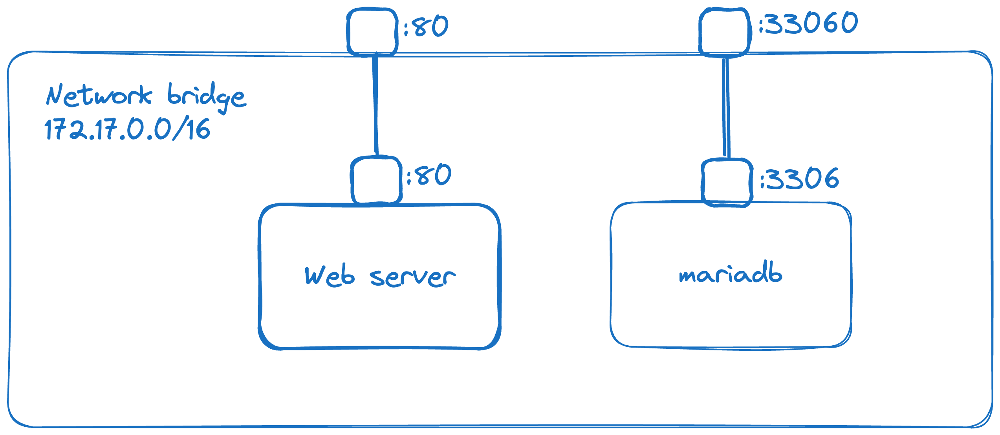

# WordPress Installation Guide

WordPress is a free, open-source content management system (CMS) written in PHP and based on MySQL or MariaDB databases. Distributed by the WordPress.org foundation, WordPress allows users to create and manage various types of websites, including blogs, portfolios, online stores, institutional sites, and more.

As of February 1, 2023:

- WordPress was used by 43.2% of websites worldwide.
- Its closest competitors were Shopify (3.8%) and Wix (2.5%), while open-source competitors included Joomla! (1.8%) and Drupal (1.2%).
- 32% of websites did not use a CMS.

This guide outlines how to properly install WordPress using Docker and Docker Compose.

## Objectives

- Basic Docker Compose setup with MariaDB and Apache.
- Backup and restore functionality (e.g., create a post and test restoration).
- Change default passwords and manage credentials outside the `docker-compose.yml` file.
- Separate DMZ and isolated networks for database security.
- Add monitoring within the isolated network (URL checks, service checks, disk space monitoring).
- Add web containers with DNS round-robin.
- Implement a load balancer with sticky sessions.
- Create certificates and enable HTTPS.

## Getting Started

### Target Architecture



### Prerequisites

You need Docker and Docker Compose installed:

```bash
sudo apt-get update
sudo apt install docker docker-compose -y
sudo usermod -aG docker $USER
docker ps
docker run hello-world
docker-compose version
```

> **Note:**
>
> Check the [official Docker documentation](https://docs.docker.com/engine/install/ubuntu/) for the most up-to-date installation steps for your system.


### Installation

The `docker-compose.yml` file specifies the containers, network configuration, environment variables, and persistent storage. Adapt the configuration to your needs.

> **Notes:**
>
> - Docker volumes `db_data` and `wordpress_data` retain database updates, themes, and plugins installed through WordPress. [Learn more about Docker volumes](https://docs.docker.com/storage/volumes/).
> - WordPress Multisite works only on ports 80 and 443.

Place yourself in the directory containing the `docker-compose.yml` file.

> **Caution:**
> Modify the following environment variables before running Docker Compose:

| Variable                | Default Value |
| ----------------------- | ------------- |
| MYSQL\_ROOT\_PASSWORD   | somewordpress |
| MYSQL\_DATABASE         | wordpress     |
| MYSQL\_USER             | wordpress     |
| MYSQL\_PASSWORD         | wordpress     |
| WORDPRESS\_DB\_HOST     | db            |
| WORDPRESS\_DB\_USER     | wordpress     |
| WORDPRESS\_DB\_PASSWORD | wordpress     |
| WORDPRESS\_DB\_NAME     | wordpress     |

Run the following command to start the containers:

```bash
docker compose up -d
```

This runs [`docker compose up`](https://docs.docker.com/engine/reference/commandline/compose_up/) in detached mode, pulls the required Docker images, and starts the WordPress and database containers, as shown below:

```bash
Creating network "my_wordpress_default" with the default driver
Pulling database (mysql:5.7)...
5.7: Pulling from library/mysql
efd26ecc9548: Pull complete
a3ed95caeb02: Pull complete
...
Digest: sha256:34a0aca88e85f2efa5edff1cea77cf5d3147ad93545dbec99cfe705b03c520de
Status: Downloaded newer image for mysql:5.7
Pulling wordpress (wordpress:latest)...
latest: Pulling from library/wordpress
efd26ecc9548: Already exists
a3ed95caeb02: Pull complete
589a9d9a7c64: Pull complete
...
Digest: sha256:ed28506ae44d5def89075fd5c01456610cd6c64006addfe5210b8c675881aff6
Status: Downloaded newer image for wordpress:latest
Creating my_wordpress_database_1 ... done
Creating my_wordpress_wordpress_1 ... done
```

> **Note:**
> If WordPress Multisite is enabled, it only works on ports 80 and/or 443. If you encounter a port binding error, ensure that no other service is using these ports.


### Accessing WordPress in a Web Browser

At this stage, WordPress should be running on port 80 of your Docker host. Open `http://localhost:80` in a web browser to complete the famous "five-minute installation" as a WordPress administrator.

> **Note:**
> The WordPress site may take a few minutes to become available on port 80 as the containers initialize.

If you are using Docker Desktop for Mac or Windows, you can also access the site via `http://localhost`.


## Usage

Your blog should now be online with its first page!

## Sources

- [Docker Engine Installation Guide](https://docs.docker.com/engine/install/ubuntu/)